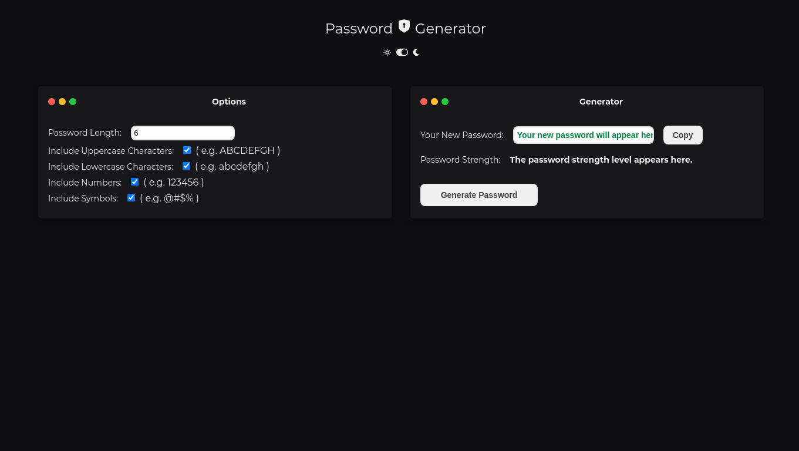
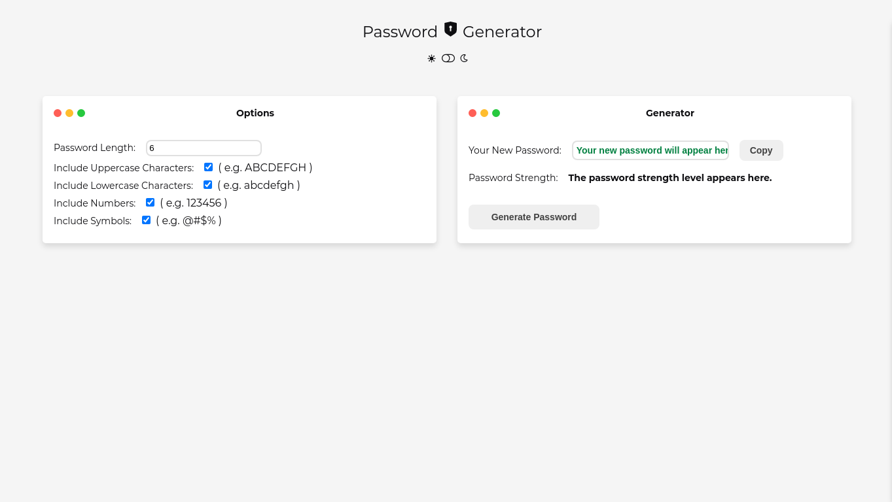

<p align="center">
  <h1 align="center">
    Password Generator
  </h1>
</p>

## About the project

Password Generator is an application that facilitates your password creation, making it stronger and more secure.

## 🎨 Layout

#### We have two themes: Dark and Light.

### Dark

<h4 align="center">
  
  
</h4>

### Light

<h4 align="center">
  
  
</h4>

## Technologies

Technologies and tools used in the development of the project:

- [React](https://reactjs.org/)
- [TypeScript](https://www.typescriptlang.org/)
- [Sass](https://sass-lang.com/)
- [React Icons](https://react-icons.github.io/react-icons/)

<br>

## Installation and use

```bash
# Open a terminal and copy this repository with the command
git clone https://github.com/erikalbuquerque/password-generator.git
# or use the download option.

# Enter the web folder with
cd password-generator

# Install the dependencies
yarn install

# Run the application
yarn start

# Go to http://localhost:3000 in your browser.
```
<br>

# :eyes: Demo
👉 Demo: https://password-generator-erikalbuquerque.vercel.app/

create by :purple_heart: [Érik Albuquerque](https://github.com/erikalbuquerque)

[](https://www.linkedin.com/in/erik-albuquerque/)
[](mailto:erik.albuquerque.oficial@gmail.com)
